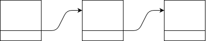
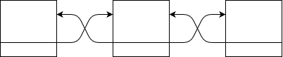
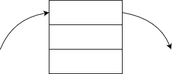
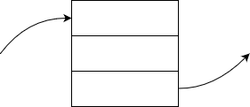
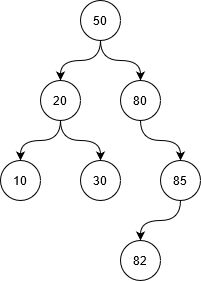
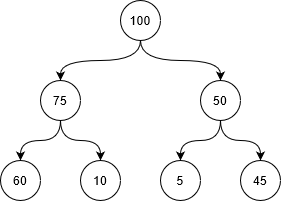
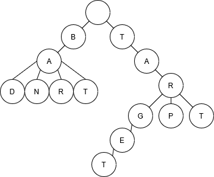

# structures

## Linked List


```go
type node struct {
	Value interface{}
	Next  *node
}

type LinkedList struct {
	Head   *node
	Tail   *node
	Length int
}
```
```go
	ll := linkedlist.LinkedList{}
	ll.Append(value)
	ll.Prepend(value)
	ll.Insert(1, value)
	ll.Delete(value)
```

## Doubly Linked List


```go
type dllNode struct {
	Value interface{}
	Prev  *dllNode
	Next  *dllNode
}

type DoublyLinkedList struct {
	Head   *dllNode
	Tail   *dllNode
	Length int
}
```
```go
	dll := linkedlist.DoublyLinkedList{}
	dll.Append(value)
	dll.Prepend(value)
	dll.Insert(1, value)
	dll.Delete(value)
```

## Stack


```go
type node struct {
	value interface{}
	next  *node
}

type Stack struct {
	Top    *node
	Length int
}
```
```go
	s := stackqueue.Stack{}
	s.Push(value)
	value = s.Pop()
	next := s.Peek()
```

## Queue


```go
type Queue struct {
	ll linkedlist.LinkedList
}
```
```go
	q := stackqueue.Queue{}
	q.Enqueue(value)
	value = q.Dequeue()
	next := q.Peek()
```

## Binary Search Tree


```go
type Node struct {
	Left  *Node
	Right *Node
	Value int
}

type BinarySearchTree struct {
	Root *Node
}
```
```go
	t := tree.BinarySearchTree{}
	t.Insert(50)
	node := t.Lookup(50)
	t.Remove(50)
```

## Binary Heap


```go
type BinaryHeap struct {
	A []int
}
```
```go
	h := tree.BinaryHeap{}
	h.Insert(100)
	max := h.ExtractMax()
	h.Delete(50)
	h.ModifyValue(1, 25)
	i, ok := h.Search(75)
```

## Trie


```go
type trieNode struct {
	children    [26]*trieNode
	isEndOfWord bool
}

type Trie struct {
	Root *trieNode
}
```
```go
	tr := tree.Trie{}
	tr.Insert("test")
	tr.Delete("test")
	ok := tr.Search("test")
	keys := tr.Keys()
```
